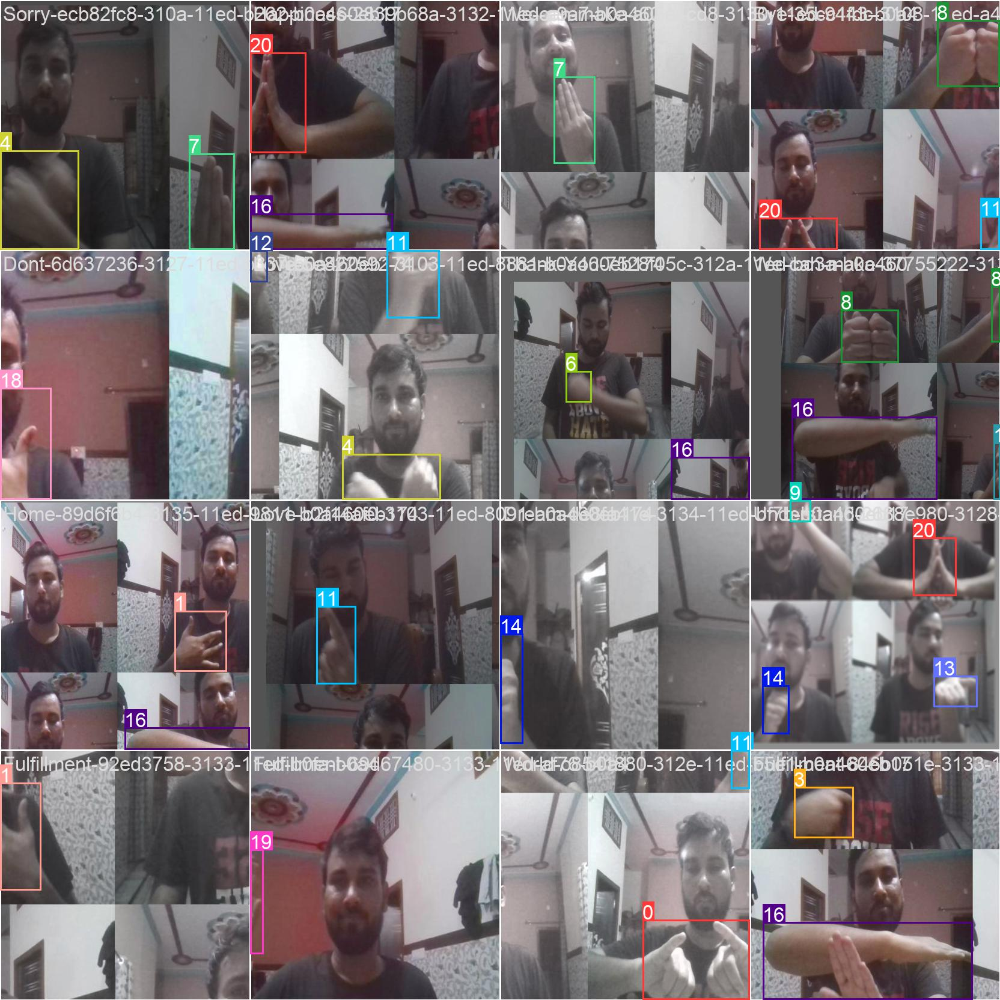

## project: Sign Language Recognition using yolov5



Created this project in order to understand the sign language.

This project is made with the help of yolov5.


Annotation of images are done with an open source tool named 'labelimg'.

I have captured the images on my own. If you want to contribute to the project may be we can collaborate.

<video width="320" height="240">
<source src="signlanguagerecognition.mp4" type="video/mp4">
</video>

# How to run?

### STEPS:

Clone the repository

```bash
https://github.com/aibi10/sign-language-recognition
```

## create environment


https://user-images.githubusercontent.com/45706760/190912512-2616aae5-4279-4cee-9a56-5c56ac5f98ba.mp4


```bash
conda create -n signlanguage python=3.7 -y
```

## activate environment

```bash
source activate signlanguage
```

## writing conda

```bash
conda env export > conda.yaml
```

## change current directory yolov5

```bash
cd yolov5
```

## install the requirements

```bash
pip install -r requirements.txt
```

## run run.py

```bash
python run.py
```

```bash
Author: Abhishek Singh
Data Scientist
Email: isingh.abhishek10@gmail.com

```
